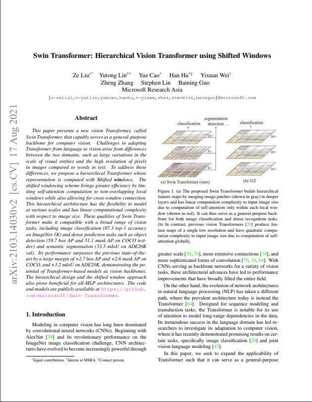
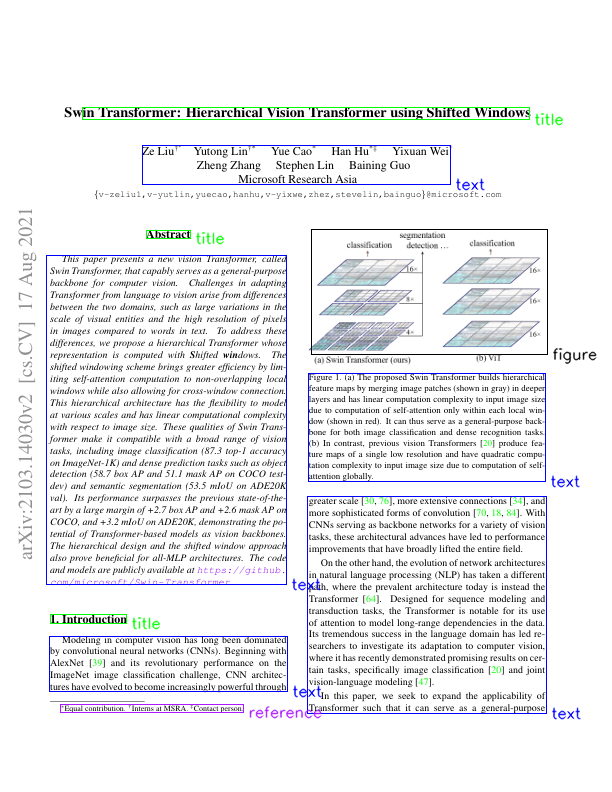

<h1 align='center'> Research Paper Analysis </h1>

<h2 align='left'>Idea </h2>
&nbsp;&nbsp;&nbsp; The General idea is that we are going to build a system capable of doing locating various segments of research papers like: 
    <ul>
        <li> Text </li>
        <li> Title </li>
        <li> Figures </li>
        <li> Tables </li>
        <li> References </li>
        <li> header </li>
    </ul>
We are also going to compare all the existing methods and check which ones perfom very well.   

<h2 align='left'> 1. Paddle OCR </h2>
&nbsp;&nbsp;&nbsp; Initially we start with Paddle OCR and check how it performs for extraction of various components.  
Repo to Padddle OCR: <a href='https://github.com/PaddlePaddle/PaddleOCR'> Paddle </a>
  
A Brief concept of Paddle can be gained from the image below: 

Here are some of the results we have obtained from Paddle COR:  
<h2> Results: </h2> 

<table>
    <tr>
        <th> Original Images </th>
        <th> Paddle Ocr Image </th>
    </tr>
    <tr>
        <td></td>
        <td> </td>
    </tr>
    <tr>
        <td></td>
        <td> </td>
    </tr>
    <tr>
        <td></td>
        <td> </td>
    </tr>
        
</table>

